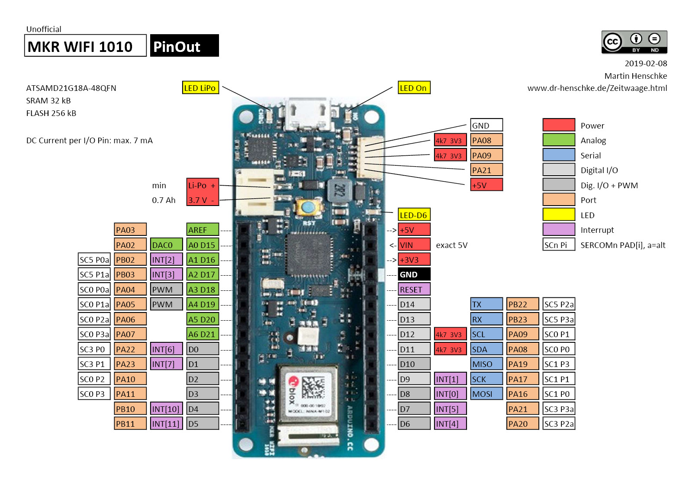

# Accessibility Remote Control

Design project #3 for ES1050 course at University of Western Ontario.

This project contains the source code for Arduino MKR 1010 boards:
- **IRTrasmitter** - the Arduino board that trasmits the infrared signal
- **Trigger** - the Arduino board which takes the user input (push button)

# Dependecies

- [IRremote](https://github.com/z3t0/Arduino-IRremote) - library that helps to send/receive infrared signal 
- [WiFiNINA](https://www.arduino.cc/en/Reference/WiFiNINA) - library to control the WiFi and BLE chips on the MKR1010
- [extEEPROM](https://github.com/PaoloP74/extEEPROM) - library to help write configuration to an expernal EEPROM chip

# MKR1010 Board Pinout

